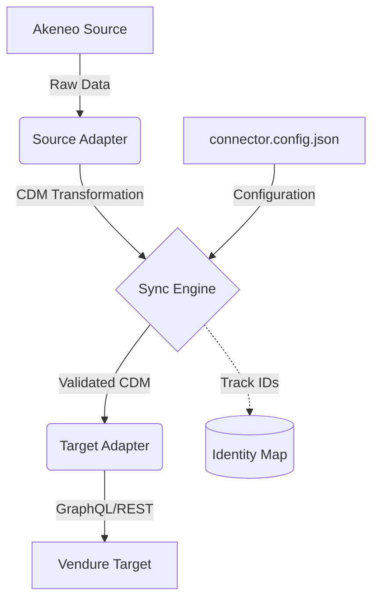

# PIM Connector

A modular synchronization platform to connect **Akeneo Cloud PIM** with **Vendure Commerce**.

## Features

- **Full & Incremental Sync**: Supports complete catalog sync or updates since a specific date.
- **Dry-Run Mode**: Simulate synchronization to verify mappings without affecting live data.
- **Safe Retries**: Built-in exponential backoff to handle concurrent database locks (common in SQLite).
- **Type Safety**: Fully validated configuration using Zod and a shared Canonical Data Model (CDM).

## Architecture

The platform follows a decoupled adapter pattern using a **Canonical Data Model (CDM)**. This ensures that adding a new
PIM or Commerce target only requires a new adapter without touching the core sync logic.



- **Core**: Orchestrates the flow and handles data mapping.
- **Adapters**: System-specific wrappers for API communication.
- **CDM**: A shared language (Product, Variant, Price) that decouples source from target.

## Quick Start

### 1. Prerequisites

- Node.js v22+
- pnpm
- Akeneo Cloud PIM instance with API access
- Vendure Commerce instance with Admin API access

### 2. Setup

```bash
# Clone the repository
git clone <repository-url>
cd pim-connector

# Install dependencies
pnpm install

# Build all packages
pnpm build
```

### 3. Configuration

#### Environment Variables

1. Copy the environment template:

```bash
cp .env.example .env
```

2. Update `.env` with your actual credentials:

```bash
# Akeneo Cloud PIM credentials
AKENEO_URL=https://your-akeneo-domain.com
AKENEO_CLIENT_ID=your_client_id
AKENEO_SECRET=your_secret
AKENEO_USERNAME=your_username
AKENEO_PASSWORD=your_password

# Vendure Commerce credentials
VENDURE_URL=http://localhost:3000/admin-api
VENDURE_EMAIL=superadmin
VENDURE_PASSWORD=superadmin
```

#### Connector Configuration

The `connector.config.json` file contains the main synchronization settings:

- **Source Configuration**: Source connection details and configurations
- **Target Configuration**: Target connection details and configurations
- **Mapping Rules**: Attribute mapping between source and target
- **Sync Options**: Performance and retry settings

### 4. Usage

Run the CLI within the `packages/cli` package or via workspace filter:

```bash
# Full product synchronization
pnpm sync

# Full product synchronization simulation (no writes)
pnpm sync --dry-run

# Incremental sync (sync products updated since specified date)
pnpm sync --since=2024-01-01

# Sync categories only
pnpm category-sync
```

> **Note:** Run with `--dry-run` first to validate the mappings before running the actual sync.

## Project Structure

- `packages/core`: Shared types, CDM, Mapping Engine, and Sync Orchestrator.
- `packages/adapter-akeneo`: Source adapter for Akeneo Cloud API.
- `packages/adapter-vendure`: Target adapter for Vendure Admin API.
- `packages/cli`: Command-line interface for running sync missions.
