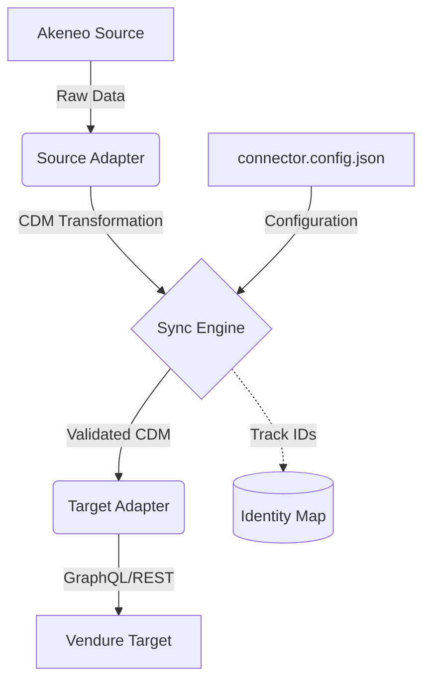

# PIM Connector

A modular synchronization platform to connect **Akeneo Cloud PIM** with **Vendure Commerce**.

## Features
- **Full & Incremental Sync**: Supports complete catalog sync or updates since a specific date.
- **Generic Mapping Engine**: Map complex Akeneo attributes to Vendure fields using simple dot-notation in configuration.
- **Dry-Run Mode**: Simulate synchronization to verify mappings without affecting live data.
- **Safe Retries**: Built-in exponential backoff to handle concurrent database locks (common in SQLite).
- **Type Safety**: Fully validated configuration using Zod and a shared Canonical Data Model (CDM).

## Architecture

The platform follows a decoupled adapter pattern using a **Canonical Data Model (CDM)**. This ensures that adding a new PIM or Commerce target only requires a new adapter without touching the core sync logic.



- **Core**: Orchestrates the flow and handles data mapping.
- **Adapters**: System-specific wrappers for API communication.
- **CDM**: A shared language (Product, Variant, Price) that decouples source from target.

## Quick Start

### 1. Prerequisites
- Node.js v22+
- pnpm

### 2. Setup
```bash
# Install dependencies
pnpm install

# Build all packages
pnpm build

# Copy example config (and fill with your credentials)
cp connector.config.example.json connector.config.json
```

### 3. Usage
Run the CLI within the `packages/cli` package or via workspace filter:

```bash
# Full synchronization
pnpm --filter @pim-connector/cli start sync

# Simulation (no writes)
pnpm --filter @pim-connector/cli start sync --dry-run

# Incremental sync
pnpm --filter @pim-connector/cli start sync --since=2024-01-01
```

## Project Structure
- `packages/core`: Shared types, CDM, Mapping Engine, and Sync Orchestrator.
- `packages/adapter-akeneo`: Source adapter for Akeneo Cloud API.
- `packages/adapter-vendure`: Target adapter for Vendure Admin API.
- `packages/cli`: Command-line interface for running sync missions.

## License
MIT
